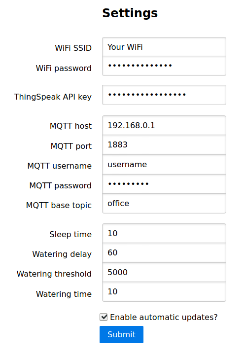
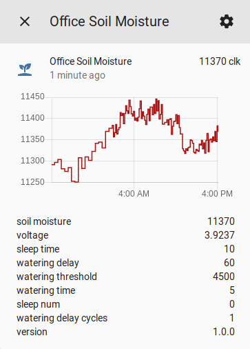
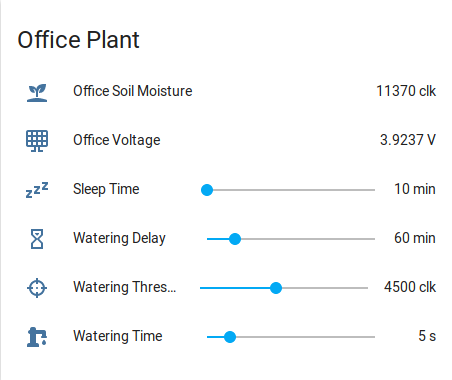

# Plant watering ESP8266
_________

[](https://github.com/MadsBornebusch/PlantWateringESP8266/actions?query=branch%3Amaster)

This is a plant watering ESP8266.

The code is licensed under the GNU GENERAL PUBLIC LICENSE Version 3 in the LICENSE file.

The PCB is licensed under the Creative Commons Attribution-ShareAlike 4.0 license due to using an [ESP8266 kicad library](https://github.com/jdunmire/kicad-ESP8266) and a particular [soil moisture probe design](https://github.com/acolomitchi/cap-soil-moisture-v2).

# PCB

## Pinout when seen from component side:

Left side from top:

- FTDI_RX
- FTDI_TX
- SDA
- SCL
- GND
- Battery VCC

## Right side from top:

- Battery VCC IN
- GND
- VCC (3.3 V)
- Watering OUT

# Settings

The WiFi, ThingSpeak and MQTT settings can be configured via a web interface:



If you do not want to use ThingSpeak simply leave the `ThingSpeak API key` field empty. Similarly the MQTT can be disabled by leaving the `MQTT base topic` empty.

At first boot the module will turn on a hotspot with the SSID: `PlantWateringESP8266` and password: `plantsarecool`.

After logging on to the WiFI simply navigate to <http://plantwateringesp8266.local> or <http://192.168.4.1> to configure the module.

The device can be put back into hotspot mode by shorting the TX and RX pins and restarting the module.

A new firmware and file system image can be uploaded by navigation to <http://plantwateringesp8266.local/update> or <http://192.168.4.1/update>.

# [Home Assistant](https://www.home-assistant.io/)

Simply activate [MQTT discovery](https://www.home-assistant.io/docs/mqtt/discovery/) by adding the following to your `configuration.yaml` file:

```yaml
mqtt:
  discovery: true
```

Assuming your plant is named `office` it will now show up as a sensor like so:



The name of the plant is taken from the `MQTT base topic` and get be chaned via the [HTTP settings](#Settings) page.

## Advanced Home Assistant configuration

This section will guide you through on how to set the `sleep time`, `watering delay`, `watering threshold` and `watering time` directly via the Home Assitant overview page.

First add the following to your `configuration.yaml` file:

```yaml
input_number:
  office_sleep_time:
    name: Sleep Time
    min: 10
    max: 60
    step: 5
    icon: mdi:sleep
    unit_of_measurement: min
  office_watering_delay:
    name: Watering Delay
    min: 0
    max: 360
    step: 10
    icon: mdi:timer-sand
    unit_of_measurement: min
  office_watering_threshold:
    name: Watering Threshold
    min: 0
    max: 10000
    step: 100
    icon: mdi:target
    unit_of_measurement: clk
  office_watering_time:
    name: Watering Time
    min: 1
    max: 30
    step: 1
    icon: mdi:water-pump
    unit_of_measurement: s
```

This will create four [sliders](https://www.home-assistant.io/integrations/input_number/), one for each parameter. Remember to replace `office` with the `MQTT base topic` you have set via the web interface.

Now add the following to your `automations.yaml` file:

```yaml
- alias: Plant set slider
  trigger:
  - platform: mqtt
    topic: 'plant/+/config'
  action:
  - service: input_number.set_value
    data_template:
      entity_id: input_number.{{ trigger.topic.split('/')[1] }}_sleep_time
      value: "{{ trigger.payload_json.sleep_time | float }}"
  - service: input_number.set_value
    data_template:
      entity_id: input_number.{{ trigger.topic.split('/')[1] }}_watering_delay
      value: "{{ trigger.payload_json.watering_delay | float }}"
  - service: input_number.set_value
    data_template:
      entity_id: input_number.{{ trigger.topic.split('/')[1] }}_watering_threshold
      value: "{{ trigger.payload_json.watering_threshold | float }}"
  - service: input_number.set_value
    data_template:
      entity_id: input_number.{{ trigger.topic.split('/')[1] }}_watering_time
      value: "{{ trigger.payload_json.watering_time | float }}"

- alias: Plant slider moved
  trigger:
  - platform: state
    entity_id:
      - input_number.office_sleep_time
      - input_number.office_watering_delay
      - input_number.office_watering_threshold
      - input_number.office_watering_time
  action:
  - service: mqtt.publish
    data_template:
      # The topic should always be the after the dot and before the name of the variable we want to set
      topic: "plant/{{ trigger.entity_id.split('.')[1].split('_')[:-2] | join('_') }}/config"
      retain: true
      payload: >
        
        {
          "sleep_time": {{ states('input_number.' + topic + '_sleep_time') | int }},
          "watering_delay": {{ states('input_number.' + topic + '_watering_delay') | int }},
          "watering_threshold": {{ states('input_number.' + topic + '_watering_threshold') | int }},
          "watering_time": {{ states('input_number.' + topic + '_watering_time') | int }}
        }
```

This makes sure that the MQTT config topic is updated when the slider is moved and that the slider is always set to the MQTT config topic when it changes.

Finally you can add the two sensors and the inputs slider into on group by adding the following to `groups.yaml`:

```yaml
office_plant:
    name: "Office Plant"
    icon: mdi:sprout
    control: hidden
    entities:
    - sensor.office_soil_moisture
    - sensor.office_voltage
    - input_number.office_sleep_time
    - input_number.office_watering_delay
    - input_number.office_watering_threshold
    - input_number.office_watering_time
```

The plant will now show up in the Home Assistant overview like so:



# TODO lists

## TODO

- [x] Add Kicad PCB project
- [x] Add some form of license

## TODO code

- [x] [OTA update via http](https://arduino-esp8266.readthedocs.io/en/latest/ota_updates/readme.html#http-server)
- [ ] OTA update via Github release - enable/disable using checkbox
- [ ] Send via MQTT when it watered the plant
- [ ] Verify checksum of flashed binary
- [x] [Support Home Assistant discovery](https://www.home-assistant.io/docs/mqtt/discovery/)
- [x] Make a struct for variables to save in RTC memory
- [ ] Only check for OTA update once per day (24 hr)
- [ ] [Use SPIFFS file system to store configuration file (soil moisture etc)](https://arduino-esp8266.readthedocs.io/en/latest/filesystem.html)
- [x] Set the sleep time, watering delay, water threshold and water time via MQTT
- [ ] [Support secure MQTT (SSL)](https://github.com/marvinroger/async-mqtt-client/blob/master/examples/FullyFeaturedSSL/src/main.cpp)
- [x] Use MQTT for data
- [x] Show MQTT data in Home Assistant

## TODO code (low priority)

- [ ] Try long sleeps and only wake rf on the last wakeup
- [ ] Define for printing stuff to serial
- [ ] Other ways to read soil moisture?
- [ ] Check power consumption in sleep and awake
- [ ] Header file with definitions?
- [ ] Better structure: move functions out of main files
- [ ] Read I2C sensors (such as BME environment sensors)
